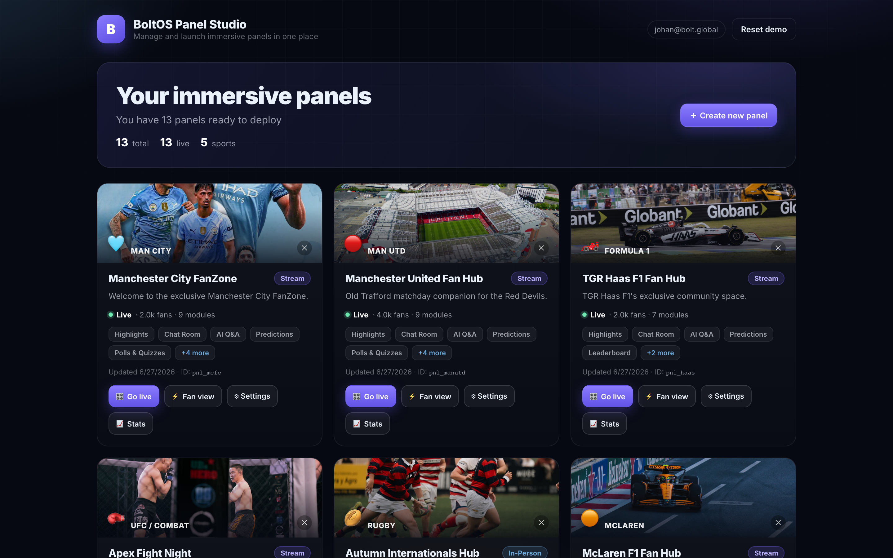
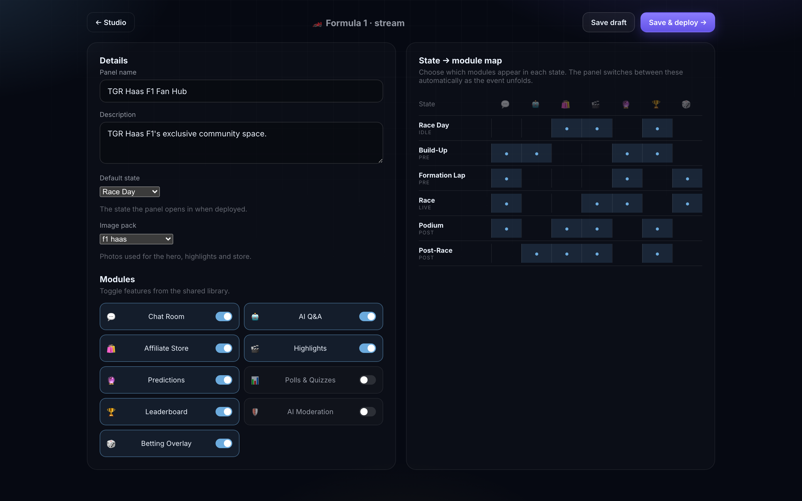
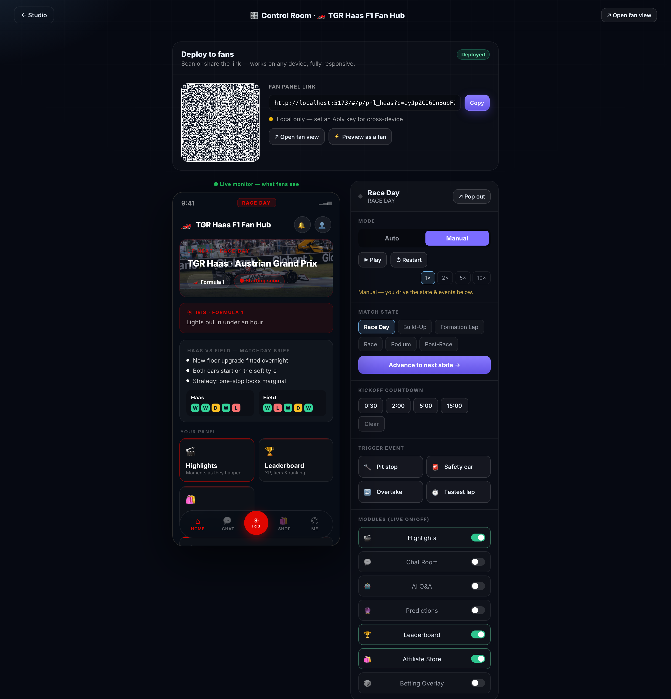
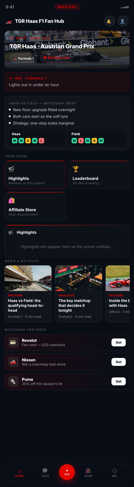
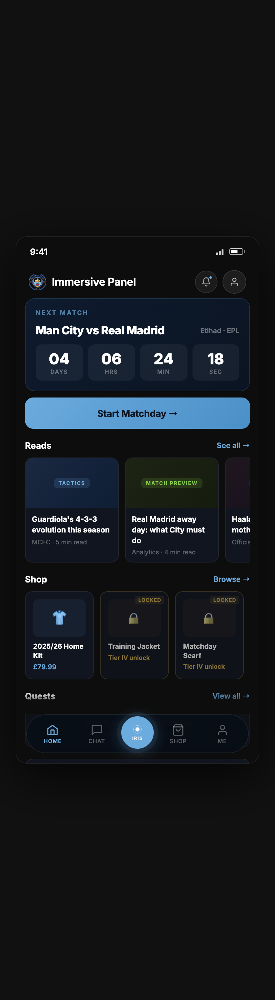
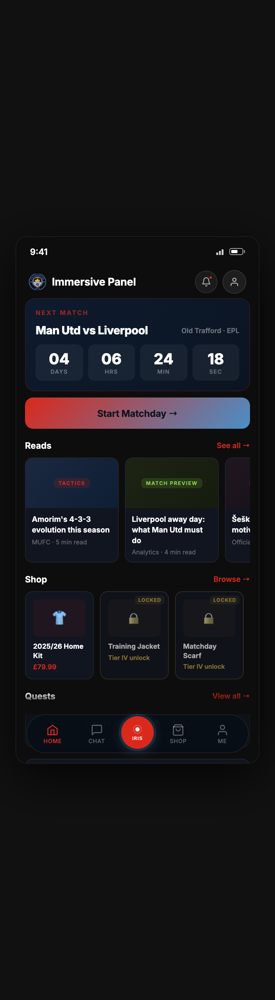

# BoltOS Immersive Panel Platform — Technical & Product Documentation

**Status:** Working prototype, deployed
**Live:** https://danielokpechi.github.io/immersive-panel/
**Repo:** https://github.com/danielokpechi/immersive-panel
**Audience:** Product, engineering, and commercial stakeholders evaluating what
we have and what it takes to make it a production product.

---

## 1. Executive summary

The Immersive Panel Platform lets an operator **stand up a branded, second-screen
fan experience for any live event in minutes**, deploy it to fans via a QR code,
and **drive it live during the event** — pushing state changes (kickoff, goal,
half-time), toggling features on and off, and firing moment-overlays that land on
every connected fan's phone in real time.

One codebase, three ideas:

1. **One engine, many sports.** A single data-driven renderer produces a native-
   feeling panel for football, F1, UFC, rugby, basketball, tennis, cricket,
   esports and conferences. Each sport is *data* (a state machine + content
   "flavor"), not bespoke code.
2. **Operator ↔ fan separation.** The admin "Control Room" and the fan panel are
   distinct surfaces that talk over a single real-time seam. The operator drives;
   fans follow, on their own devices, anywhere.
3. **Bespoke where it matters.** The flagship Manchester City experience is a
   hand-built, high-fidelity prototype. We can reskin it per club (names, colours,
   photos, real rosters) and run it side-by-side with the generic engine.

This document explains how it's built, what's real vs. simulated, and a costed,
phased plan to take it to production at scale.

---

## 2. Product tour (figure index)

The prototype has the following surfaces. Capture each from the live site (run
**Reset demo** first for clean seed data). `<host>` = `https://danielokpechi.github.io/immersive-panel`.

| # | Surface | URL / state | What it shows |
|---|---------|-------------|---------------|
| 1 | **Studio dashboard** | `<host>/#/studio` | Panel library — photo-cover cards per team, live/draft status, fan counts, modules, quick actions. The operator's home. |
| 2 | **Create panel — experience** | `<host>/#/studio/new` | Choose delivery mode (stream / VOD / in-person). |
| 3 | **Create panel — sport** | `<host>/#/studio/new` → continue | Pick the event type (10 sports). |
| 4 | **Panel editor / Settings** | `<host>/#/studio/pnl_haas/edit` | Name, description, **default state**, **image pack**, module library toggles, and the **state × module matrix**. |
| 5 | **Control Room** | `<host>/#/control/pnl_haas` | Deploy & share (QR + link + live-sync status), the **live monitor**, and the master controls (mode, match state, countdown, triggers, live module on/off). |
| 6 | **Fan panel — engine, pre-match** | `<host>/#/p/pnl_haas` | F1 fan view: hero, IRIS, matchday brief (squad news + form), module tiles, news & articles, partners. |
| 7 | **Fan panel — engine, live** | `pnl_haas`, operator at "Race" | Live hero (position/score), live-stats strip, live timeline, real shared chat. |
| 8 | **Fan panel — legacy (Man City)** | `<host>/#/p/pnl_mcfc` | The bespoke MCFC matchday: image slider, countdown, reads, shop (tiered unlocks), quests. |
| 9 | **Fan panel — legacy reskinned (Man Utd)** | `<host>/#/p/pnl_manutd` | The same bespoke design, fully reskinned: "Man Utd vs Liverpool", red, Old Trafford, Šeško/Mbeumo, MUN. |
| 10 | **Stats page** | `<host>/#/studio/pnl_haas/stats` | Per-panel analytics mock. |
| 11 | **Module — Store** | any engine fan → Affiliate Store tile | Working basket (add / qty / checkout), team product photos. |
| 12 | **Module — Chat** | engine fan in a chat state → Chat | Real cross-device chat (every fan sees every fan). |

### Visual tour

Captured screenshots live in [`docs/screenshots/`](./screenshots) (regenerate any
time with `node scripts/capture-screenshots.mjs` against a running dev server).

**Admin — Studio dashboard**


**Admin — Panel editor** (default state, image pack, module library, state×module matrix)


**Admin — Control Room** (deploy/QR, live monitor, master controls)


**Fan — engine panel** (F1, pre-match: hero, brief, modules, news, partners)


**Fan — flagship bespoke (Man City)** &nbsp;|&nbsp; **Fan — reskinned (Man Utd)**



Other captures: `02-create-experience`, `05-stats`, `07-fan-engine-store`.

**Full Man City flagship archive** — every screen of the bespoke matchday
prototype (all 62: onboarding, home, pre-match, live, goal, half-time,
full-time, shop, quests, predictions, polls, chat, photo pool, stadium floor
plan, food ordering, rewards/tiers, IRIS assistant flows, sponsor deals, …) is
captured in [`docs/screenshots/mancity/`](./screenshots/mancity). Regenerate
with `node scripts/capture-mancity-pages.mjs`.

---

## 3. Architecture

### 3.1 Current shape (serverless prototype)

```
                       ┌───────────────────────────────────────┐
                       │  GitHub Pages (static CDN)             │
                       │  React 19 SPA  +  legacy HTML prototype│
                       └───────────────────────────────────────┘
                          │  loads on every device (no server)
          ┌───────────────┼─────────────────────────────┐
          ▼               ▼                              ▼
   Operator laptop   Fan phone A                    Fan phone B
   (Control Room)    (#/p/<id>)                     (#/p/<id>)
          │               ▲                              ▲
          │  Commands     │  Commands + Chat             │
          └──────────►  Ably realtime cloud  ◄───────────┘
                       (pub/sub, one channel per panel)
```

There is **no application server of our own.** The frontend is a static bundle on
a CDN; the only backend is **Ably**, a hosted realtime pub/sub service. This is
deliberate for a prototype: zero ops, free to run, instant global distribution.

### 3.2 Stack

| Layer | Choice | Why |
|-------|--------|-----|
| Language | TypeScript | Type-safe domain model across a multi-sport surface. |
| UI | React 19 | Components + hooks; the panel is a pure function of runtime state. |
| Build | Vite 8 | Fast builds, code-splitting (Ably is a lazy chunk). |
| Routing | react-router 7 (**HashRouter**) | No server rewrites needed on static hosting; deep links + QR links just work. |
| Realtime | **Ably** | Hosted pub/sub; pairs with static hosting; generous free tier. |
| Hosting | **GitHub Pages** | Static, free, CDN-backed; CI deploy on push to `main`. |
| Lint/test | oxlint, vitest | Fast feedback. |

Build output (gzipped): app ~107 KB, Ably ~49 KB (lazy), CSS ~7 KB. The whole
thing is a few hundred KB — it loads instantly on a phone over stadium wifi.

### 3.3 The core seam: the ControlBus

Everything real-time flows through one abstraction, `ControlBus` (keyed per
panel id). It carries three message types:

- **Command** (console → panels): `setMode`, `play/pause`, `jumpState`,
  `advance`, `setCountdown`, `fireEvent`, `setModule`, `requestState`, `sync`.
- **Telemetry** (panel → console): current state, phase, clock, mode, visible modules.
- **Chat** (fan → all fans).

It runs **two transports at once**, deduplicated by a stamped message id:

- **BroadcastChannel + localStorage** — same browser (free, instant). Also the
  transport the legacy prototype speaks.
- **Ably** — cross-device, when an API key is configured.

This is the single seam a production backend slots into. Swapping Ably for a
self-hosted websocket layer, or adding persistence, touches *one file*.

### 3.4 Two renderers, one contract

- **Engine renderer (`PanelShell`).** A data-driven React panel. A *SportPack*
  defines a state machine (`pre → live → break → post`), a scripted timeline, a
  theme, and default modules. A *flavor* supplies hero style, competitors, the
  live-stats strip and crowd names. The same component renders every sport; the
  sport is data.
- **Legacy renderer.** The original hand-built Manchester City matchday prototype
  (vanilla HTML/JS, loaded in an iframe). It's higher-fidelity and bespoke. A
  **reskin engine** rewrites it per club on load — swapping names, the brand
  colour (hex + rgba), the baked-in photos (for the club's image pack), and the
  real roster/manager/venue via a per-club name map.

A panel chooses its renderer with a `renderer` flag (football defaults to legacy;
any panel can opt into the engine). Both speak the same ControlBus contract, so
the operator drives them identically.

### 3.5 Data model

A panel is a single serializable object (`PanelConfig`): id, name, sport,
experience, description, enabled modules, a **state × module map** (which modules
show in each phase), branding (name, emoji, colours, competitors), default state,
image-pack key, renderer, status. This object is **self-contained** — it is
encoded (base64url) into the share link, so a fan on a brand-new device renders
the exact panel with no backend lookup.

### 3.6 Real-time control flow

1. Operator clicks "Goal" in the Control Room → `fireEvent` published to the
   panel's Ably channel.
2. Every connected fan's runtime applies it → overlay + timeline update; engine
   panels animate, the legacy panel maps it to its own flows.
3. **Late join:** a fan opening mid-match sends `requestState`; the Control Room
   replies with a `sync` (current state + operator's module overrides) and the
   fan snaps to the live moment.

---

## 4. Design principles

1. **The panel is a pure function of state.** No imperative DOM poking in the
   engine; render = f(runtime). This makes live control, replay and late-join
   sync tractable.
2. **Sports are data, not code.** Adding a sport is a pack + flavor, not a new
   screen. This is what makes "any event type" credible.
3. **Operator authority, fan autonomy.** Fans run their own copy (resilient to
   flaky wifi) but follow the operator. No fan can desync the room.
4. **Bespoke and generic coexist.** The flagship gets hand craftsmanship; the
   long tail gets the engine. The reskin engine bridges them.
5. **Design system fidelity.** A single token set (brand palette, module
   metadata) drives both renderers, so the generic panels feel on-brand with the
   bespoke one.
6. **Ship self-contained.** Share links encode the whole panel; QR works on any
   device with nothing to install.

---

## 5. How we built it (decision log)

- Started from the bespoke MCFC prototype and a multi-sport React shell.
- **Separated operator from fan** and introduced the ControlBus seam.
- **Added Ably** for cross-device control; kept BroadcastChannel for local dev.
- **Self-contained share links + QR** so any device renders any panel.
- **Killed auto-advance** so the operator drives state (then made the legacy
  matchday auto-play but operator-overridable).
- **Made the live module on/off authoritative** (force-on adds a module even if
  the state omits it) and synced it to late joiners.
- **Made every module real** where it matters: shared chat over Ably, working
  store basket, per-sport identity (names, leaderboard, store items).
- **Personalized with photo packs** (hero, news, store) and a premium Studio
  redesign (photo-cover cards, animated backdrop).
- **Unified, then re-split football:** moved football to the engine for modules,
  then restored the bespoke MCFC design on a `renderer` flag and built the
  **reskin engine** so other clubs get that design with real rosters.

Every change shipped through CI to the live site.

---

## 6. Current reach — what's real vs. simulated

**This is a high-fidelity prototype, not a product.** It is honest about that.

| Capability | Today (prototype) | Real product needs |
|------------|-------------------|--------------------|
| Panel storage | Browser `localStorage` (per device) | A database + API; panels shared across operators/devices. |
| Auth | None (anyone with the URL is "the operator") | Operator accounts, roles, org/tenant isolation. |
| Realtime | Ably, **API key shipped in the client** | Token auth (server-minted, capability-scoped). |
| Live event data | A **scripted timeline** per sport | A live sports-data feed (Opta/Sportradar) or manual operator input. |
| Chat | Real-time, but **ephemeral & unmoderated** | Persistence, moderation, identity, rate limits. |
| Store | Working basket, **no checkout** | Real catalog + payments + fulfilment. |
| Predictions / polls | Local, **fake tallies** | Server aggregation, anti-cheat, per-fan identity. |
| AI Q&A / IRIS | **Canned** responses | A real LLM with event context (RAG). |
| Content (news/articles) | **Generated placeholder** copy | A CMS feeding real editorial. |
| Analytics / "fan counts" | **Cosmetic** | Real telemetry pipeline. |
| Media (highlights) | **Photos** standing in for clips | Video ingest, transcode, CDN, clipping. |
| Legacy reskin | Names/colours/photos/roster swapped; **a few opponent-side details and hard-coded stats remain** | Fully data-driven club templates. |
| Compliance | None | Betting licensing/geo, age-gating, GDPR, accessibility. |

**Scale ceiling today:** Ably's free tier (~200 concurrent connections). Fine for
testing and small pilots; a stadium needs a paid tier (see §8).

---

## 7. What it takes to fully build this out

This is the production architecture and the concrete services, in detail.

```
        Fans (web/PWA/native)          Operators (web)
              │                              │
              ▼                              ▼
   ┌──────────────────────────────────────────────────┐
   │  Edge / CDN (Cloudflare)  — static app, caching   │
   └──────────────────────────────────────────────────┘
              │                              │
              ▼                              ▼
   ┌───────────────────┐         ┌──────────────────────┐
   │ Realtime (Ably/    │         │  API (Node/Edge fns) │
   │ Pusher/Supabase)   │◄───────►│  + Auth (Clerk/Auth0)│
   │ token-authed       │         └──────────┬───────────┘
   └───────────────────┘                     │
              ▲                               ▼
   ┌──────────┴──────────┐         ┌──────────────────────┐
   │ Sports data feed     │         │ Postgres (Supabase/  │
   │ (Sportradar/Opta)    │         │ Neon) + Redis cache  │
   └─────────────────────┘         └──────────┬───────────┘
                                               ▼
            CMS (Sanity)   Payments (Stripe)   Media (Mux/Cloudflare Stream)
            Moderation (OpenAI/Perspective)    Analytics (Tinybird/BigQuery)
```

### 7.1 Backend & API
- **Runtime:** Node or edge functions (Cloudflare Workers / Vercel). Edge for
  read-heavy/low-latency; a small origin for heavier jobs.
- **API:** REST or tRPC for panels, deployments, content, orders. ~2–4 weeks for
  a solid v1 (CRUD + auth + realtime token minting).
- **Database:** **Postgres** (Supabase or Neon). Tables: orgs, users, panels,
  deployments, sessions, chat_messages, predictions, poll_votes, orders, content.
  Add **Redis** (Upstash) for hot counters (live poll/prediction tallies, presence).

### 7.2 Realtime (the heart of it)
- Keep **Ably** (or Pusher / Supabase Realtime). Move the API key off the client:
  a server endpoint mints **capability-scoped tokens** (fans: subscribe + publish
  chat; operators: publish control). This is the single most important security
  fix.
- Use **presence** for real fan counts and **history** for late-join replay.

### 7.3 Auth & multi-tenancy
- **Clerk** or **Auth0** for operator accounts; org/tenant model so clubs only
  see their panels. Fans stay anonymous (or light social/SSO for chat identity &
  rewards).

### 7.4 Live event data
- **Sportradar**, **Stats Perform/Opta**, or **Genius Sports** for live feeds
  (goals, cards, lineups, possession). Normalize each feed into our existing
  event contract — the engine already consumes `fireEvent`/`jumpState`, so the
  feed adapter is the new work. Manual operator input remains the fallback.

### 7.5 Content (the "news/articles/formation/stats")
- A **headless CMS** (Sanity / Strapi / Contentful) for editorial: articles,
  partner promos, shop merchandising, club templates. This is what turns the
  generated placeholder copy into a real matchday brief and replaces the legacy
  reskin's hard-coded bits with data-driven club templates.

### 7.6 Commerce
- **Stripe** for checkout; a product catalog in the DB or via the club's existing
  store (Shopify Storefront API). Affiliate tracking for partner promos.

### 7.7 AI / IRIS
- An **LLM** (Anthropic Claude) with **RAG** over the live event + club content
  for genuine "what just happened / who's the standout" answers. Streaming
  responses. Guardrails + caching to control cost.

### 7.8 Media / highlights
- **Mux** or **Cloudflare Stream** for video ingest, transcode, and delivery;
  auto-clipping around fired events. This replaces the photo stand-ins.

### 7.9 Moderation & safety
- **OpenAI moderation** or **Perspective API** on chat; rate limiting; profanity
  + abuse filters; an operator kill-switch (already modeled as the moderation
  module).

### 7.10 Mobile
- Ship the fan panel as a **PWA** first (installable, offline shell, push
  notifications) — cheap, no app store. Native (React Native / Expo) later if
  push reliability and stadium performance demand it.

### 7.11 Domain, infra, observability
- **Domain** (~$12–40/yr) + managed DNS/SSL via Cloudflare (free).
- **CI/CD:** GitHub Actions → Cloudflare/Vercel.
- **Observability:** Sentry (errors), a logs/metrics stack, uptime monitoring,
  and a status page. Load-test realtime before any big matchday.

---

## 8. Scaling

The architecture scales because of one property: **fan-out is the realtime
provider's problem, not ours.** One operator publishing to N fans is exactly what
Ably/Pusher are built for. Going from 50 to 50,000 fans is a **billing-tier
change, not a re-architecture.** What we own scaling-wise:

- **Connections, not messages, are the limit.** We publish only when the operator
  acts; payloads are tiny. Capacity planning is "peak concurrent fans."
- **Hot counters** (polls/predictions/presence) go through Redis, not Postgres,
  to avoid write hot-spots.
- **Static app on a CDN** scales infinitely and cheaply; the dynamic surface is
  the API (stateless, horizontally scalable) + realtime (managed).
- **Regional**: realtime providers are multi-region; add read replicas + edge
  caching for global events.
- **Cost is roughly linear in concurrent fans** (realtime) plus near-zero for the
  static app — see below.

### Indicative monthly infra cost by scale

| Scale (peak concurrent fans) | Realtime | DB + cache | Media/AI/other | ~Monthly |
|---|---|---|---|---|
| Pilot (≤200) | Free tier | Free/€0–25 | minimal | **~$0–50** |
| Club season (1–5k) | $50–300 | $25–100 | $50–300 | **~$150–700** |
| Big matchday (20–50k) | $1–4k (event-based) | $200–600 | $500–3k | **~$2–8k** |
| Tier-1 final (100k+) | $5–15k+ (negotiated) | $1k+ | $3k+ | **~$10–30k** |

Realtime is the dominant variable cost; most providers bill on
peak-connections + messages and will do event/enterprise pricing for big spikes.
Media (if real video) and AI (if heavy IRIS use) are the next biggest. The static
frontend and our API are rounding errors by comparison.

### Build cost & timeline (engineering)

| Phase | Scope | Team | Time |
|---|---|---|---|
| **MVP / production-ready** | Auth, DB-backed panels, token-authed realtime, real chat (persist + moderate), Stripe checkout, PWA, observability | 2–3 engineers + 1 designer | **8–12 weeks** |
| **Live + content** | Sports-data feed adapter, CMS, real IRIS (LLM+RAG), analytics | +1–2 engineers | **+8–12 weeks** |
| **Media + scale + compliance** | Video highlights, load-tested realtime, betting/geo/age compliance, native if needed | +specialists | **+8–16 weeks** |

Rough order-of-magnitude build cost: a credible production v1 is a **~$120–250k**
engagement; full platform with media + compliance trends toward **~$400–700k**,
depending on how much live-data and video you light up.

---

## 9. Security, privacy & compliance (must-do before scale)

- **Realtime token auth** (stop shipping the API key client-side).
- **Tenant isolation** — clubs can't see each other's panels/data.
- **Chat:** identity, moderation, rate limits, abuse reporting, retention policy.
- **GDPR/UK-GDPR:** consent, data minimization, right-to-erasure for fan data.
- **Betting module:** licensing, geo-fencing, age verification, responsible-
  gambling messaging — or ship it disabled by market.
- **Accessibility:** the fan panel must hit WCAG AA (stadium + diverse devices).
- **Pen-test + load-test** before any high-profile event.

---

## 10. Risks & mitigations

| Risk | Mitigation |
|---|---|
| Realtime cost spikes on big matchdays | Event-based pricing; presence sampling; degrade gracefully. |
| Live-data feed licensing cost/complexity | Start operator-driven; add a feed per priority sport. |
| Stadium connectivity | Self-contained panels run locally; reconcile on reconnect. |
| Content freshness (per-club) | CMS + templated club packs instead of hard-coded reskin. |
| Compliance (betting/data) | Feature-flag by market; legal review before launch. |

---

## 11. Bottom line

We have a **deployed, end-to-end prototype** that proves the hard, differentiated
part: **one operator driving a branded, multi-sport, second-screen experience to
many fans' devices in real time**, with a flagship bespoke build and a reskinnable
engine behind it. It runs today with zero servers.

To make it a product, the work is **well-understood and mostly integration**, not
invention: stand up auth + a database + token-authed realtime (the MVP), then
layer live-data, content, commerce, AI and media. The architecture was built so
that backend slots into a single seam, and so that **scale is a pricing decision,
not a rebuild.**
